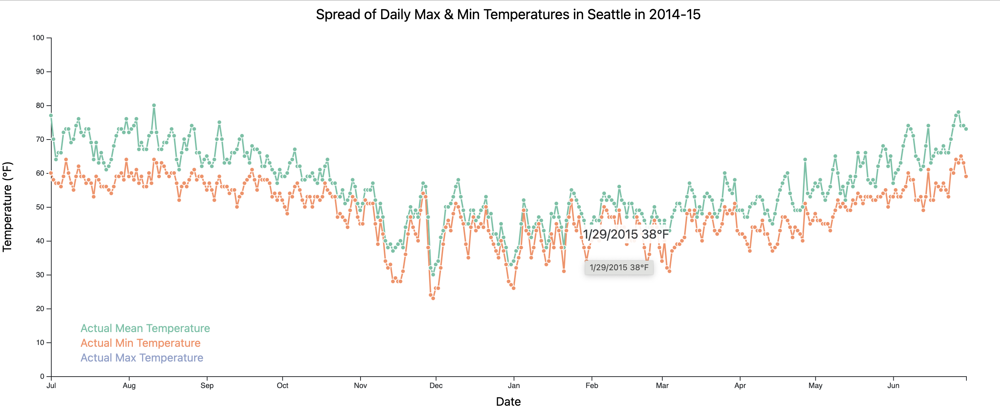
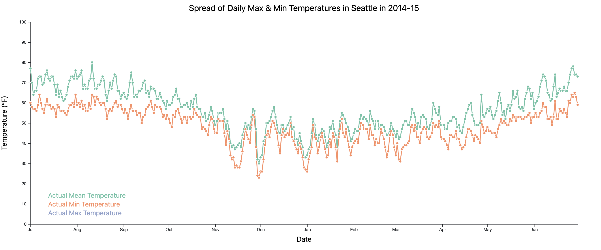
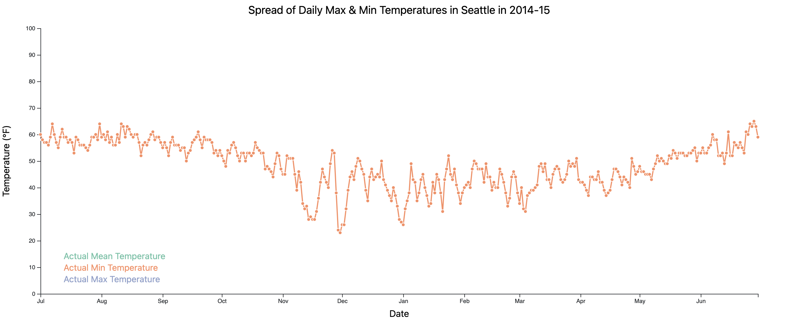

# Temperature Trends in US Cities D3.js Visualization

# Project Overview

Within this repository, you'll find the culmination of a challenging data visualization project. I've leveraged D3.js and JavaScript to craft an interactive visualization that explores temperature trends in various US cities over a year. This project demonstrates my ability to create engaging and informative data visualizations while adhering to best practices in information design. Explore the visualization to uncover insights into weather patterns, and feel free to reach out with any questions or feedback.

# Design Overview

This multiple series connected scatter plot displays temperature data of Seattle for the year 2014-15. The graph displays three lines showing the actual mean, minimum, and maximum temperature for each day of the year. The y-axis shows the temperature in Fahrenheit, and the x-axis shows the date of the year for the one-year period. 

The graph has interactive features such as hover-over tooltips and a legend that allows the user to click on any line in the legend which makes the lines appear and disappear in order to compare any trends in a visually effective manner. The graph is designed with the objective of clearly communicating the temperature trends in Seattle over the course of the year and examining how the spread of data looks throughout the year for daily means, mins, and maxes.

Here are some questions that can be used to describe the data and analyze it further:

1. What is the range of temperatures observed in Seattle during 2014-15?
2. What was the highest temperature observed during the year, and on what date?
3. What was the lowest temperature observed during the year, and on what date?
4. On what days of the year were the minimum and maximum temperatures closest to the mean?
5. On what days of the year were the minimum and maximum temperatures furthest from the mean?
6. Are there any clear patterns or trends in temperature fluctuations?

The graph has a clean and simple design, with minimal colors and lines, making it easy to read and interpret the data. The use of a legend makes it easy to distinguish between the three lines being plotted. The ability to click the legend and remove and add lines as needed allows the user to clearly see any large differences between temperature mins and maxes for given days and general time frames. The hover-over tooltips provide additional information about the data points, allowing users to analyze the data more closely. It allows users to see the exact date that the temperature is recorded as well as the temperature itself in Fahrenheit. The use of abbreviated month names on the x-axis makes it easy to identify the time of the year when the temperature is at its highest or lowest. The use of points on the lines allows the user to clearly distinguish individual data points that were recorded and on which days. Overall, the visualization supports the task of exploring and understanding temperature trends in Seattle over the course of a year and provides users with an interactive and informative means of doing so.

# User Tasks

1. Analyze the temperature data to identify patterns and trends.
2. Compare the actual mean, minimum, and maximum temperature to the normal average temperature in Seattle.
3. Identify the dates when the temperature was at its highest or lowest.
4. Zoom in on specific time periods to analyze the temperature data more closely.

# User Interface

- After clicking on "Actual Max Temperature" in legend

- After clicking on both mean and max temperatures in legend

- Tooltip with date and temperature in Fahrenheit

